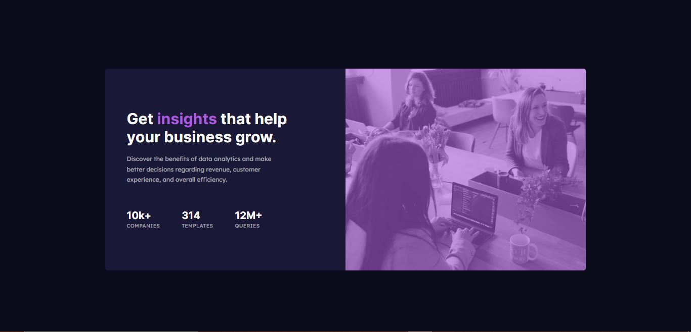

# Frontend Mentor - Stats preview card component solution

This is a solution to the [Stats preview card component challenge on Frontend Mentor](https://www.frontendmentor.io/challenges/stats-preview-card-component-8JqbgoU62). Frontend Mentor challenges help you improve your coding skills by building realistic projects. 

## Table of contents

- [Overview](#overview)
  - [The challenge](#the-challenge)
  - [Screenshot](#screenshot)
  - [Links](#links)
  - [Built with](#built-with)
  - [What I learned](#what-i-learned)
  - [Continued development](#continued-development)
- [Author](#author)

## Overview

Whew,

This was my first ever Frontend Mentor Challenge. Funnily enough, the hardest part wasn't actually coding the design, but actually getting it hosted lol. It took me quite a well to get used to GitHub's repository system and publish via Netlify (2/half hrs😭), but I eventually prevailed.

I have been practising CSS for what seems like a year now. So this challenge felt pretty comfortable as I knew the basic CSS Flexbox and Grid functionalities. Also had lots of fun doing as well :)
### The challenge

Users should be able to:

- View the optimal layout depending on their device's screen size

### Screenshot

### Links

- Solution URL: [My Solution](https://www.frontendmentor.io/solutions/stats-preview-card-component-_Tzalz82rP)
- Live Site URL: [Preview](https://jwdesktopdesign-stats-preview-card-component.netlify.app/)

### Built with
- Semantic HTML5 markup
- CSS custom properties
- Flexbox
- CSS Grid
- Desktop-first workflow

### What I learned
I should have found out about Frontend Mentor way earlier than I did becuase I didn't know I could host my websites for free. I also now getting used to GitHub and collaborate more with the community.

### Continued development

Getting better at Javascript and learning React.

## Author
- Instagram - [jwatson_16](https://www.instagram.com/jwatson_16)
- Frontend Mentor - [@JoshLander18](https://www.frontendmentor.io/profile/JoshLander18)
- Youtube - [Underrated Music](https://www.youtube.com/c/UnderratedMusicUR)
